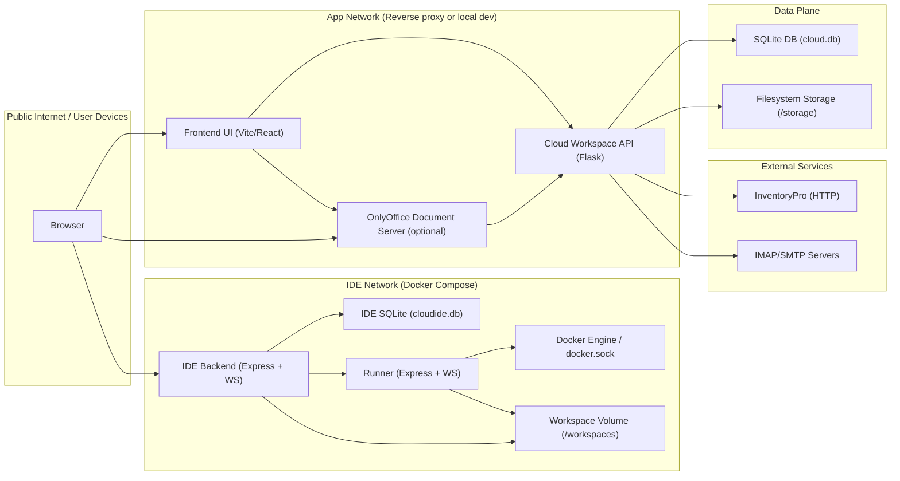

# System Map

Last updated: 2026-02-14

This is the current (as-is) component and data-flow map for `/Users/pond/cloud`.

## Components

- Browser (end-user)
- Frontend UI (`/frontend`, Vite/React)
- Cloud Workspace API (`/backend`, Flask)
- Cloud Workspace DB (`cloud.db`, SQLite by default)
- Cloud Workspace storage (`/storage`, filesystem by default)
- OnlyOffice Document Server (container, optional)
- IDE control plane (`/ide-backend`, Node/Express + WS)
- IDE control plane DB (SQLite, `cloudide.db`)
- IDE runner (`/runner`, Node/Express + WS)
- Docker Engine (runner talks to the host docker socket)
- External integrations:
  - InventoryPro (HTTP API + SSO ticket flow)
  - IMAP/SMTP servers (mail accounts)

## Data Flows (High Level)

## Trust Boundaries / Threat Surfaces (As-Is)

Public boundary
- Browser to frontend and backend APIs (HTTP).
- Browser to IDE backend (HTTP + WebSocket).
- Browser to OnlyOffice (HTTP).

Internal boundary
- Backend API to DB and filesystem storage (local).
- IDE backend to runner (internal compose network).
- Runner to docker socket (high-privilege boundary).

Secrets / credentials (current)
- Cloud backend:
  - `JWT_SECRET_KEY` for access/refresh token signing.
  - `ONLYOFFICE_TOKEN_SECRET` and related OnlyOffice JWT config.
  - `MAIL_CREDENTIALS_KEY` for mail credential encryption.
  - `INVENTORY_PRO_SHARED_SECRET` for integration auth.
- IDE backend / runner:
  - `JWT_SECRET` (IDE JWT)
  - `APP_ENCRYPTION_KEY`
  - `RUNNER_SHARED_SECRET` (runner request authentication)

Notes
- Runner has elevated capabilities via Docker socket; it must remain internal-only (no direct exposure).
- Most rate limiting and refresh-token reuse detection are in-memory today; HA deployments will require shared stores.

